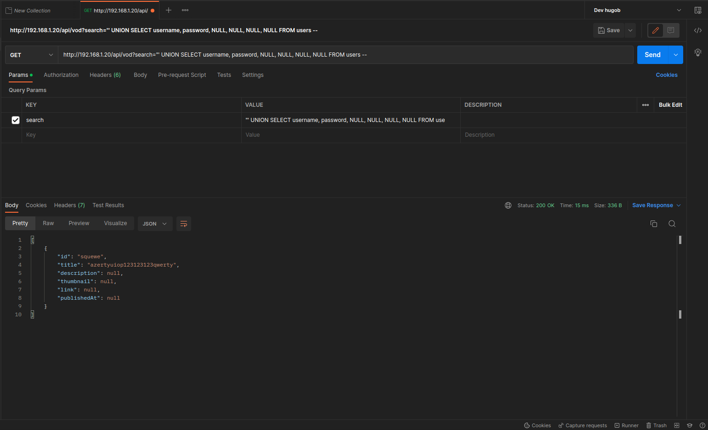
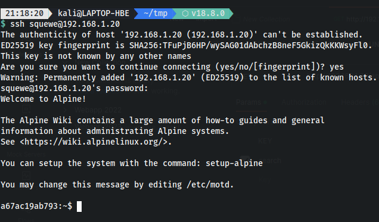
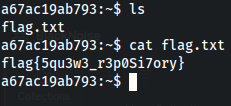

## Writeup  

### Intro  
le challenge consistait en un site web vulnérable qui recensé des vidéos youtube de la chaine [@squewe](https://www.youtube.com/@squewe).  
  

### Reconnaissance  
Pour commencer, un scan NMAP sur l'host indique ceci :  
22/tcp   open  ssh
80/tcp   open  http

Il y a donc un serveur web et un acces SSH.  

### Injection SQL   
Le champ de recherche permet de filter sur les vidéos de la page via un endpoint de l'API du backend de l'application.
`http://192.168.1.20/api/vod`  

En utilisant le champ de recherche ont s'apperçoit que chaque mide a jour de celui ci envoi une nouvelle requete a cet endpoint avec le contenu du champ.
Il était possible d'observer ceci avec l'oputil network d'un navigateur.
On peut donc supposer que le champ de texte est traité dans le backend afin d'effectuer un filtre sur les video et retourne cette liste filtrée.
### Union Based Injection   
Afin de s'assurer de la possible injection il etait possible d'utiliser sqlmap sur l'endpoint.

SQLmap nous indique que le champ permet une attaque par injection de type UNION based sur 6 champs :  
  

On en conclu donc qu'il etait possible d'explorer le contenu de la base de données grace au keyword UNION du langage SQL.  
`' UNION SELECT NULL, NULL, NULL, NULL, NULL, NULL FROM users --`  

Injecter ce parametre permet donc de retourner les vidéo + une serie de ligne vide pour chaque users, en supposant que la table users existe.  
On effectuera les interactions avec l'API via postman mais l'injection reste tout de meme possible via le champ de recherche l'application web.  

  

On remarque qu'un des objets retourné est completement vide, on suppose donc qu'il existe une table users avec un utilisateur.  

En modifiant la query, on peut y integrer les champs username et password qui sont communs aux tables d'utilisateurs des bases de données.  

`"' UNION SELECT username, password, NULL, NULL, NULL, NULL FROM users --`  

Via postman on a :  

  

On obtient ainsi un combo username password.  

### SSH connection
En effectuant un scan de port sur la machine cible, nous pouvions idenifier un acces au service SSH. En utilisant les identifiants précedement exilftrés on peut acceder à la machine qui heberge le site web :  

  

### Récuperation du flag
Le flag se trouve dans un fichier flag.txt situé dans le repertoire home de l'user squewe  
